<<<<<<< HEAD
<div align="center">

# 📖 OpenLeaf — Flutter eBook App

[](https://codemagic.io/apps/5e230defc5faa60315b1df62/5e230defc5faa60315b1df61/latest_build)
[](https://flutter.dev)
[](https://dart.dev)
[](LICENSE)
[](https://twitter.com/iamjideguru)

**A beautifully crafted, cross-platform Flutter app to browse, read, and download public domain eBooks — completely free.**

[Download APK](https://codemagic.io/apps/5e230defc5faa60315b1df62/5e230defc5faa60315b1df61/latest_build) · [App Store](https://apps.apple.com/app/openleaf/id6450374275) · [Report Bug](https://github.com/JideGuru/FlutterEbookApp/issues) · [Request Feature](https://github.com/JideGuru/FlutterEbookApp/issues)

</div>

---

## 📋 Table of Contents

- [About the Project](#-about-the-project)
- [Features](#-features)
- [Screenshots](#-screenshots)
- [Tech Stack & Architecture](#-tech-stack--architecture)
- [Plugins & Dependencies](#-plugins--dependencies)
- [Getting Started](#-getting-started)
- [Project Structure](#-project-structure)
- [Download & Install](#-download--install)
- [Author](#-author)
- [License](#-license)

---

## 🌟 About the Project

**OpenLeaf** is a fully open-source eBook reading application built with Flutter. It lets you discover, download, and read thousands of classic books from the [Public Domain](https://en.wikipedia.org/wiki/Public_domain) — works whose copyright has expired and are completely free for everyone.

Books are fetched in real time via the [Feedbooks API](http://www.feedbooks.com/api), a rich catalog of public domain literature including titles from authors like Jules Verne, Jane Austen, Arthur Conan Doyle, and many more.

<a href="http://www.feedbooks.com/">
  
</a>

### Why OpenLeaf?

- 📚 **Thousands of free books** — browse an ever-growing catalog of public domain classics
- 🌍 **Cross-platform** — runs on Android, iOS, Web, macOS, Linux, and Windows
- 🎨 **Beautiful UI** — polished light & dark themes with a reader-first experience
- 📥 **Offline reading** — download books and read them without an internet connection
- ❤️ **Favorites** — save books you love for quick access later

---

## ✨ Features

| Feature | Status |
|---|---|
| 📥 Download eBooks for offline reading | ✅ Done |
| 📖 In-app ePub reader | ✅ Done |
| ❤️ Mark books as Favorites | ✅ Done |
| 🌙 Dark Mode support | ✅ Done |
| 🗑️ Swipe-to-delete downloaded books | ✅ Done |
| 🔍 Explore & browse by categories | ✅ Done |
| 📱 Responsive layout (mobile + desktop) | ✅ Done |

---

## 📸 Screenshots

### Mobile (Light & Dark)

| Light | Dark |
|---|---|
| 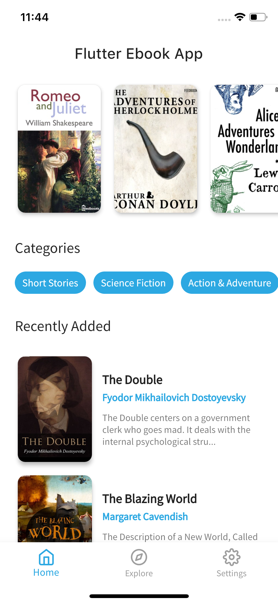 | 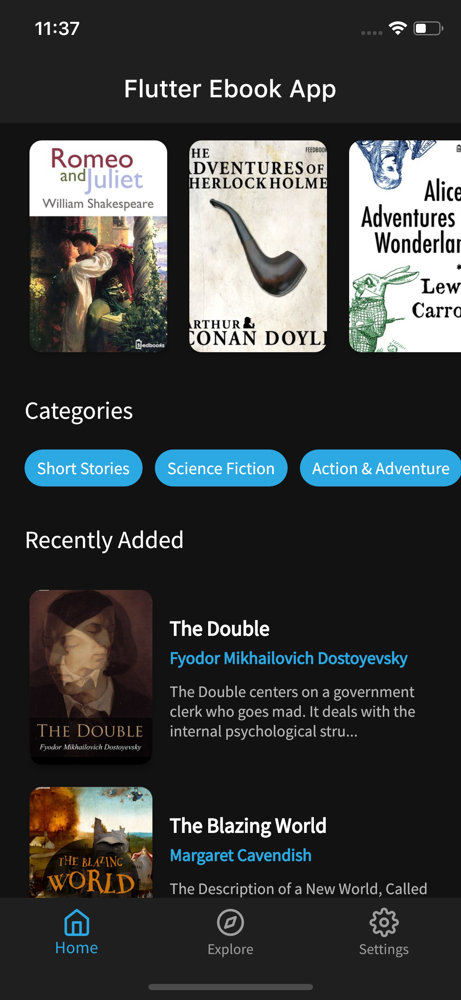 |
| 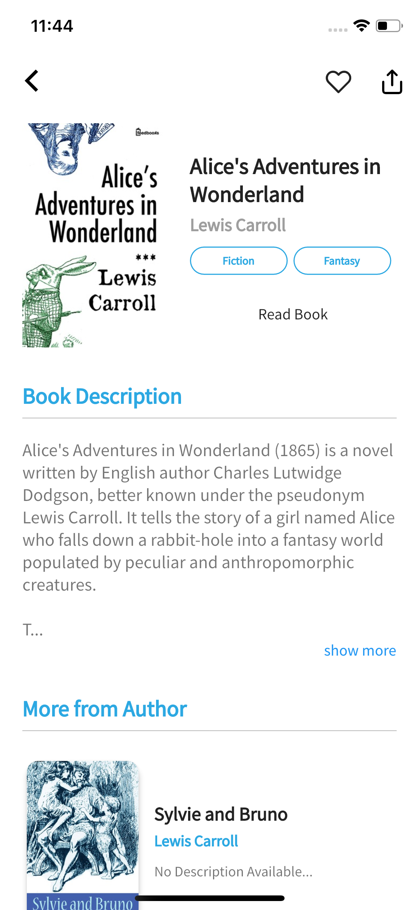 | 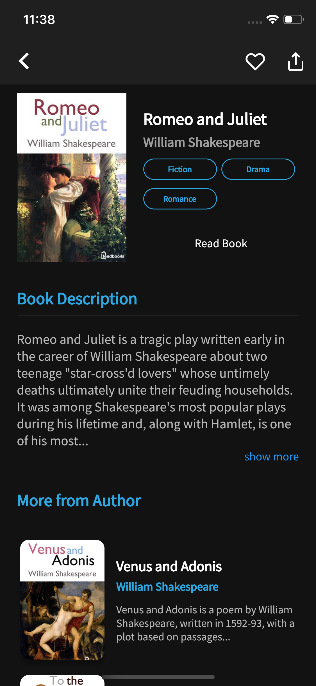 |
| 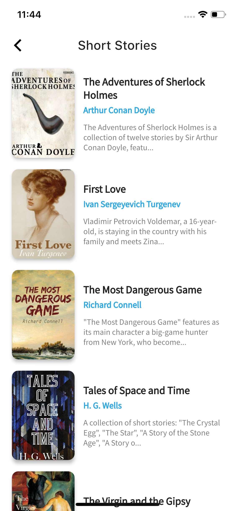 | 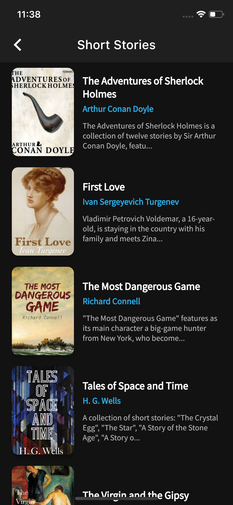 |
| 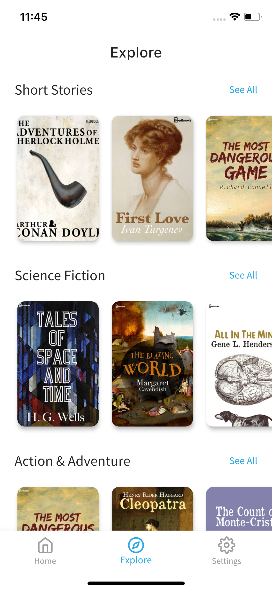 | 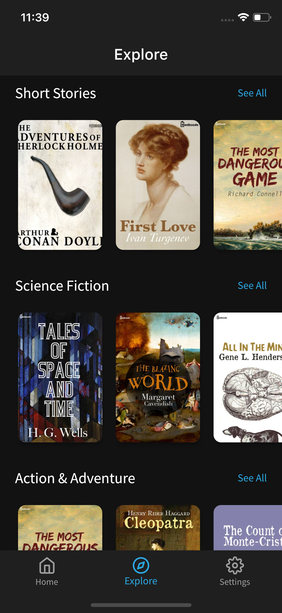 |
|  |  |
| 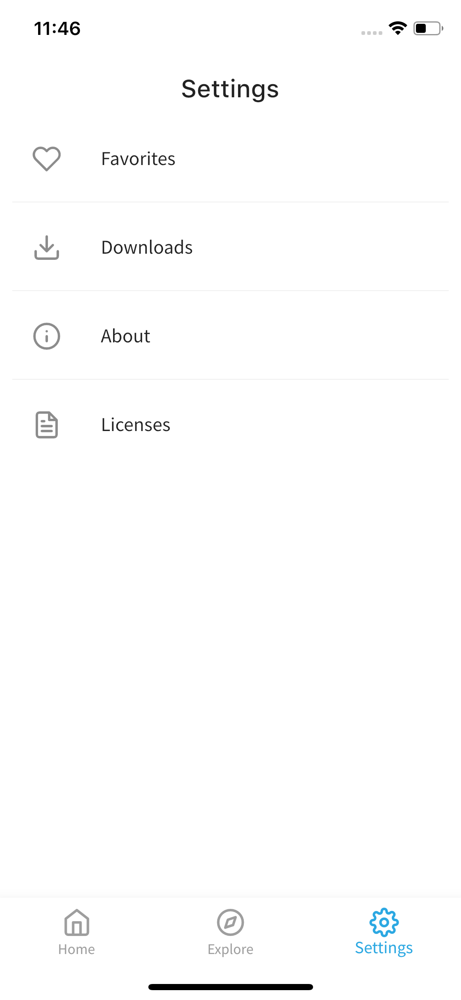 | 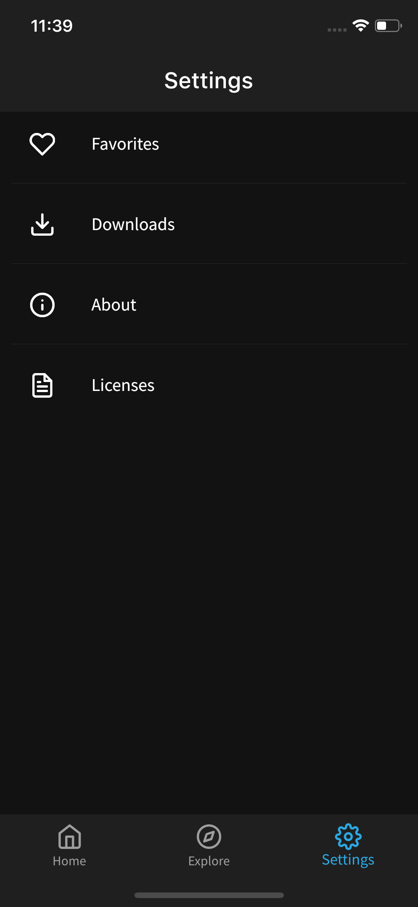 |
|  |  |

### Desktop

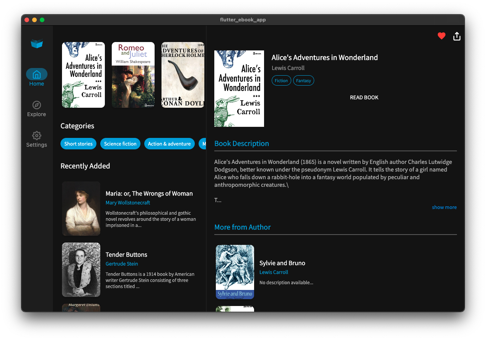

---

## 🏗️ Tech Stack & Architecture

OpenLeaf is built using a modern, scalable Flutter architecture:

- **State Management** — [Riverpod](https://pub.dev/packages/flutter_riverpod) with code generation via `riverpod_annotation`
- **Navigation** — [Auto Route](https://pub.dev/packages/auto_route) for type-safe, declarative routing
- **Local Database** — [Sembast](https://pub.dev/packages/sembast) (NoSQL) for persisting favorites and downloads
- **Networking** — [Dio](https://pub.dev/packages/dio) for API calls and file downloads
- **ePub Reader** — [Iridium Reader Widget](https://github.com/Mantano/iridium_reader_widget) for in-app book rendering
- **Data Models** — [Freezed](https://pub.dev/packages/freezed) for immutable, type-safe data classes

---

## 🔌 Plugins & Dependencies

| Plugin | Version | Purpose |
|---|---|---|
| [flutter_riverpod](https://pub.dev/packages/flutter_riverpod) | ^2.3.6 | State management |
| [auto_route](https://pub.dev/packages/auto_route) | ^7.8.4 | Declarative routing |
| [sembast](https://pub.dev/packages/sembast) | ^3.4.5 | Local NoSQL database |
| [dio](https://pub.dev/packages/dio) | ^5.4.0 | HTTP networking & downloads |
| [xml2json](https://pub.dev/packages/xml2json) | ^5.3.6 | Parse Feedbooks XML API |
| [iridium_reader_widget](https://github.com/Mantano/iridium_reader_widget) | local | ePub rendering |
| [cached_network_image](https://pub.dev/packages/cached_network_image) | ^3.3.0 | Efficient image loading |
| [freezed](https://pub.dev/packages/freezed) | ^2.3.4 | Immutable data classes |
| [google_fonts](https://pub.dev/packages/google_fonts) | ^4.0.4 | Typography |
| [path_provider](https://pub.dev/packages/path_provider) | ^2.0.15 | File system access |
| [share_plus](https://pub.dev/packages/share_plus) | ^4.5.3 | Share books |
| [shared_preferences](https://pub.dev/packages/shared_preferences) | ^2.1.1 | Lightweight key-value storage |

---

## 🚀 Getting Started

### Prerequisites

- **Flutter SDK** `>=3.3.0` — [Install Flutter](https://docs.flutter.dev/get-started/install)
- **Dart SDK** `>=3.0.0 <4.0.0`
- Any IDE: [VS Code](https://code.visualstudio.com/), [Android Studio](https://developer.android.com/studio), or [IntelliJ IDEA](https://www.jetbrains.com/idea/)

### Installation

1. **Clone the repository**

   ```bash
   git clone https://github.com/JideGuru/FlutterEbookApp.git
   cd FlutterEbookApp
   ```

2. **Install dependencies**

   ```bash
   flutter pub get
   ```

3. **Run code generation** *(required for Riverpod, Auto Route, and Freezed)*

   ```bash
   dart run build_runner build --delete-conflicting-outputs
   ```

4. **Run the app**

   ```bash
   flutter run
   ```

### Building for Production

```bash
# Android APK
flutter build apk --release

# iOS
flutter build ios --release

# Web
flutter build web --release
```

---

## 📂 Project Structure

```
lib/
├── main.dart                  # App entry point
└── src/
    ├── app.dart               # Root app widget & theme setup
    ├── common/                # Shared widgets, utilities & constants
    └── features/
        ├── splash/            # Splash screen
        ├── home/              # Home screen
        ├── explore/           # Browse & discover books
        ├── book_details/      # Book details & download
        ├── downloads/         # Offline downloaded books
        ├── favorites/         # Saved favorite books
        ├── settings/          # App settings (theme, etc.)
        └── tabs/              # Bottom navigation tabs
```

---

## 📲 Download & Install

| Platform | Link |
|---|---|
| 🤖 Android (APK) | [Download from Codemagic](https://codemagic.io/apps/5e230defc5faa60315b1df62/5e230defc5faa60315b1df61/latest_build) |
| 🍎 iOS / macOS (Apple Silicon) | [Download on the App Store](https://apps.apple.com/app/openleaf/id6450374275) |

<a href="https://apps.apple.com/app/openleaf/id6450374275">
  
</a>

---

